# Architecture

This document describes both the current (Phase 0-10) implementation and the
target architecture the project is being built toward, phase by phase. Where
a component is not yet implemented, it is marked **(planned)**.

## System context

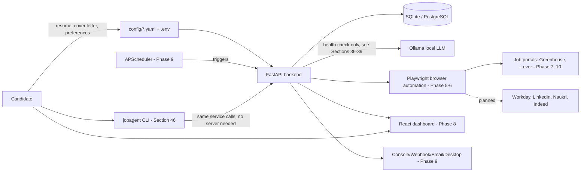

## Current implementation (Phase 0-10)

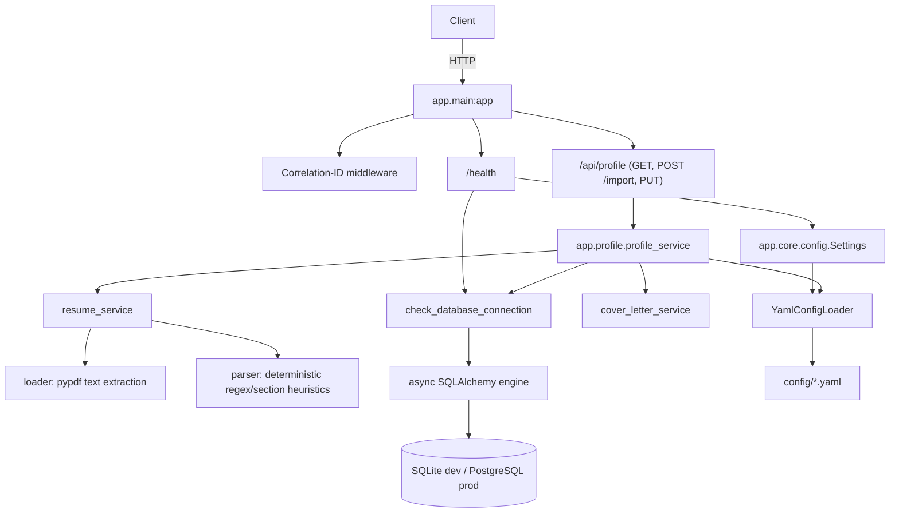

Configuration is layered:

- **`Settings`** (`app/core/config.py`) — environment-driven (`.env`),
  process-level: database URL, LLM connection, dry-run/approval defaults.
- **`YamlConfigLoader`** — domain configuration under `config/*.yaml`
  (candidate preferences, scoring weights, search policy, automation
  limits, portal registry), with `${ENV_VAR}` interpolation and per-file
  caching.

Logging is JSON-structured (`structlog`), with a per-request correlation ID
bound via contextvars and a redaction processor that strips sensitive keys
(passwords, tokens, cookies, OTPs, secrets) before anything is emitted.

### Candidate profile (Phase 1)

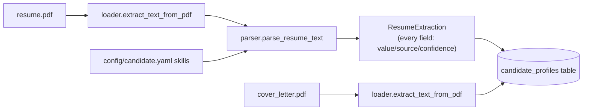

Extraction is **deterministic, not LLM-based** — per Section 2 of the design
spec, resume "understanding" is an LLM capability, but no LLM is wired up
yet (the phase list runs 0-10 and never assigns LLM integration a number —
Sections 36-39 describe it but it isn't gated behind a specific phase). So
Phase 1's parser only populates fields a defensible
rule can produce (regex for email/phone/years-of-experience, section-header
scanning for education/certifications/languages/achievements, vocabulary
matching for skills). Fields that genuinely need semantic understanding
(previous titles, companies, industries) are left as
`{"value": null, "confidence": 0.0, "source": "unextracted"}` rather than
guessed — see Section 17 ("never invent information missing from the
resume"). A future LLM-backed extractor fills the same `ExtractedField`
schema with `source="llm"` without changing any downstream consumer.

The system is single-candidate/local-first: `candidate_profiles` has exactly
one row, addressed by the fixed id `"default"` (see
`app/database/models/candidate_profile.py`).

### Job model + matching engine (Phase 2)

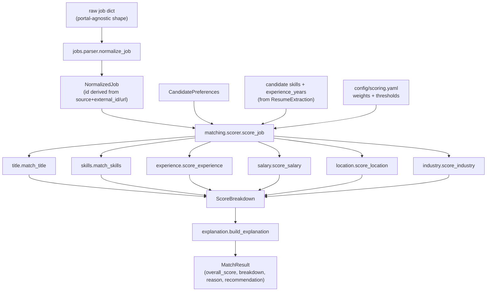

Every sub-scorer is pure rule-based logic — no LLM, no embeddings. Section
16 calls for a hybrid model (`exact rules + keyword normalization + skill
aliases + embedding similarity + optional LLM review`); Phase 2 implements
the first three (`skills.py`'s alias table resolves e.g. "Amazon Web
Services" → "AWS"; `title.py`'s family table resolves "Chief Technology
Officer" → the "CTO" family). Embedding similarity (Section 38) and LLM
semantic review are later additions layered on top — `semantic.py`
currently provides a deterministic token-overlap fallback (used by
`title.py` for titles outside every known family) with the same shape an
embedding-based implementation would have, so swapping it in later doesn't
change any caller.

Scoring never invents data to fill gaps — a job that doesn't disclose a
salary or experience range scores that dimension neutrally rather than
being guessed at or penalized (Section 17). Weights (title 25 / skills 30 /
experience 15 / industry 10 / location 10 / compensation 10) and
recommendation thresholds (`priority_apply` ≥90, `normal_apply` ≥80,
`apply_if_capacity` ≥75, `human_review` ≥60, else `reject`) both come from
`config/scoring.yaml`, never hardcoded in Python.

`NormalizedJob` (`app/jobs/models.py`) is the common schema every portal
adapter will normalize into (Phase 7+); portal-specific fields go under
`metadata` rather than contaminating the shared model (Section 8). No
`jobs`/`job_scores` database tables exist — Phase 3 persists run state via
the LangGraph checkpointer (below) rather than dedicated SQL tables; a
`jobs` table arrives if/when something other than a single in-flight run
needs to query historical jobs (e.g. the Phase 8 dashboard).

### LangGraph supervisor (Phase 3)

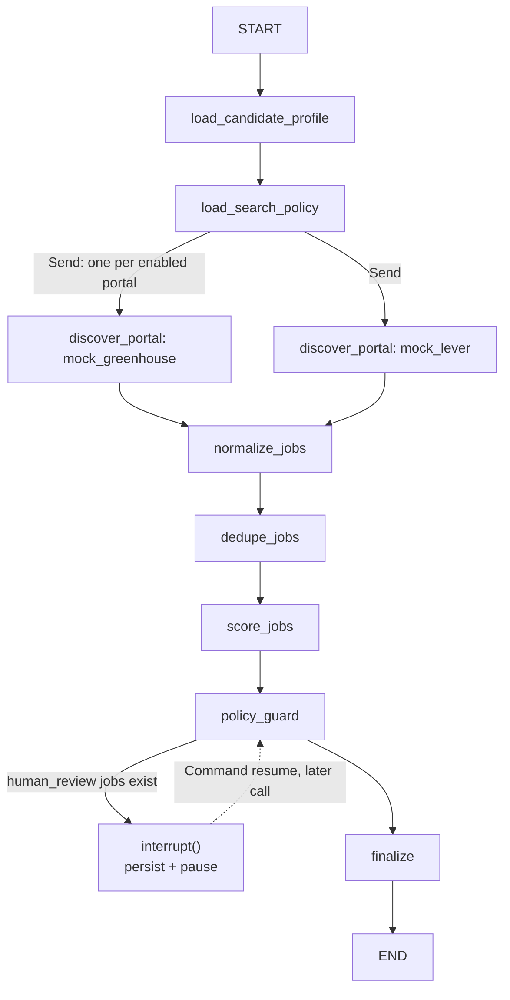

Implemented in `app/graph/`: `state.py` (`JobAutomationState`, a `TypedDict`
with `Annotated[list, operator.add]` reducers so parallel portal nodes
accumulate into `discovered_jobs` without clobbering each other — Section
24's fan-out, done via LangGraph's `Send` API rather than manual
asyncio.gather), `nodes.py`, `mock_portals.py` (two fixture portals
standing in for Phase 7's real adapters — one deliberately shares a job
with the other, company/title-family/location-identical, to exercise cross-
portal dedupe), `graph.py` (wiring + the SQLite checkpointer), and
`service.py` (`start_run`/`resume_run`/`get_run_state`, backing
`/api/runs`).

**The interrupt is real, not a stub**: `policy_guard` calls LangGraph's
`interrupt()` when any job scores in the `human_review` band (60–74).
Everything before that call re-runs identically on resume (it's pure/
deterministic), then the call returns the human's decision instead of
pausing again. Verified manually end-to-end including a genuine process
restart between pause and resume (kill the server, start a new one, `POST
/api/runs/{id}/resume` still works) — see the README's
"Running a discovery pipeline" section.

Deliberately deferred to later phases: resume selection, answer
preparation, the portal apply graph, submission, and verification (Phase
5-7); analytics (Phase 8). The diagram below shows where Phase 3 fits in
the full target picture.

### Guardrail engine (Phase 4)

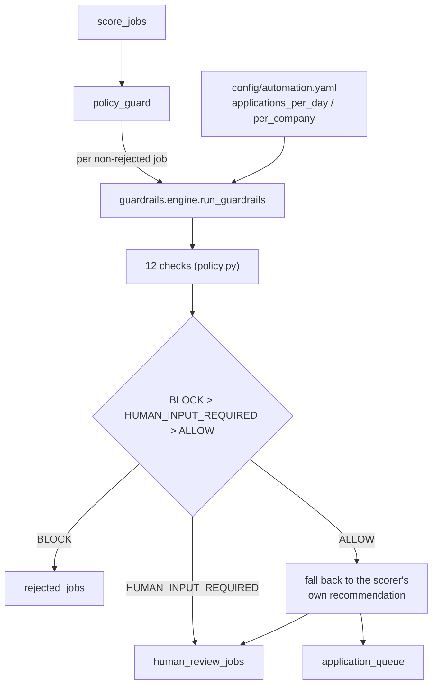

`app/guardrails/`: `models.py` (`GuardrailDecision` — `ALLOW`/`BLOCK`/
`HUMAN_INPUT_REQUIRED`, never a bare bool, so "blocked" and "needs a human"
can't be conflated), `policy.py` (12 checks: `minimum_match_score`,
`maximum_daily_applications`, `maximum_company_applications`,
`excluded_companies`/`_roles`/`_locations`, `minimum_salary`,
`experience_mismatch`, `required_work_authorization`,
`duplicate_application`, `resume_validation`, `mandatory_fields`), and
`engine.py` (orchestrates all 12, aggregates to one decision — BLOCK beats
HUMAN_INPUT_REQUIRED beats ALLOW).

**Guardrails have final say over the scorer, per Section 23** ("supervisor
must not bypass or override guardrails") — `policy_guard` runs every
non-rejected job through the engine after score-based routing, and a
guardrail can only make the outcome *more* restrictive (queue →
human_review → reject), never less. Verified live: a job scoring 91
(`priority_apply`) from an excluded company ends up in `rejected_jobs`,
its `reason` carrying both the original score explanation and the
guardrail note (`app/graph/nodes.py::_with_guardrail_note`).

**The concrete "never fabricate candidate information" guardrail**
(Section 17) is `check_experience_mismatch`: if the resume parser never
determined a number for the candidate's years of experience — Phase 1's
`ExtractedField.source == "unextracted"` — and the job states a minimum,
the check returns `HUMAN_INPUT_REQUIRED` rather than assuming eligibility
either way. It's the same provenance mechanism Phase 1 built for exactly
this purpose, not a separate new one. `required_work_authorization`
(Section 18) follows the identical pattern: `CandidatePreferences.
work_authorization` defaults to `None`, and stays `None` until the
candidate explicitly states it — never inferred.

No `applications`/`audit_events` tables exist yet, so
`maximum_daily_applications`/`maximum_company_applications` and
`duplicate_application` currently evaluate against `0`/`0`/an empty set
(`GuardrailContext`'s defaults) — the checks are fully implemented and unit
tested with non-trivial inputs, they just have no real history to count
against until Phase 7+ records actual submissions.

### Playwright form engine (Phase 5)

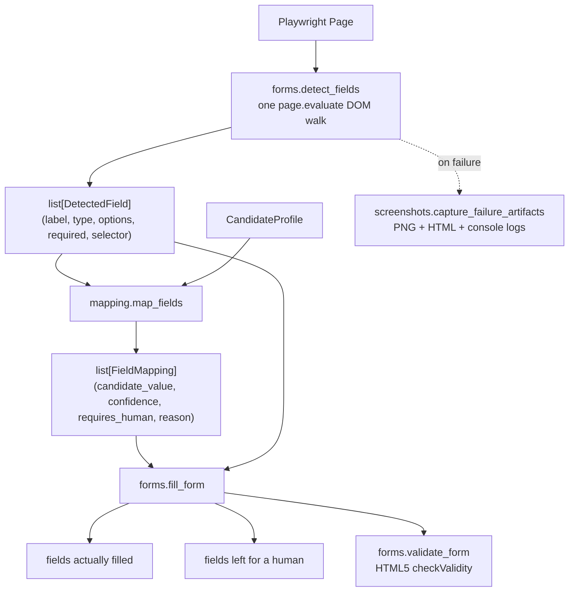

`app/browser/`: `manager.py` (launches/closes Chromium, headless
configurable), `sessions.py` (one persistent `BrowserContext` per portal,
cookies/storage saved to `data/browser_sessions/<portal>.json` so logging
in once doesn't mean logging in again next run), `selectors.py`
(`build_selector` — the priority order from Section 11: data-testid >
aria-label > role > name > id > CSS > text, pure function, no browser
needed to unit test it), `forms.py` (detect/fill/validate/upload, all
Playwright-dependent), `mapping.py` (the rule-based field-intelligence
module, Playwright-independent — pure function over `DetectedField` +
`CandidateProfile`), `screenshots.py`, `errors.py`, `models.py`
(`DetectedField`, `FieldMapping`, `FormFillResult`).

**Deterministic, not LLM-based — same reasoning as every prior phase.**
No LLM is wired up yet; `mapping.py`'s keyword-pattern table handles
label→field recognition, exactly the kind of task Section 2 says shouldn't
wait for one. A future LLM-backed classifier can replace the matching
logic without changing `FieldMapping`'s shape or any caller — same
swap-without-breaking-callers pattern as `semantic.py` in Phase 2.

**Confidence and "requires human" are never conflated with the field
simply having no known pattern.** Section 20's exact output shape
(`field`, `candidate_value`, `confidence`, `requires_human`) is
`FieldMapping`. Below `FORM_MAPPING_CONFIDENCE_THRESHOLD` (default 0.7,
`config` via `.env`) a field is never auto-filled even if a value exists —
verified live: an 18-year-experience, no-name-on-file candidate profile
run against the simple fixture form correctly filled email/phone/experience
and left `full_name` for a human, with the reason spelled out
(`"recognized as 'name' but no value is on file"`).

**Section 18's sensitive categories have no representation in the
candidate model at all** — gender, ethnicity, disability, veteran status,
religion, security clearance, criminal history always resolve to
`requires_human=True` in `mapping.py`, not because confidence is low but
because there is structurally nothing to guess from.

**Fixtures, not production portals** (Section 42): `tests/fixtures/html/`
has all ten required scenarios — simple form, multi-step, dropdown,
resume upload, required fields, an unrecognized field, OTP screen, CAPTCHA
screen, success page, failure page. The OTP/CAPTCHA screens are detected
and paused on starting Phase 6 (see below); success/failure page handling
is Phase 7's submission-verification job. All 11 e2e tests in
`tests/e2e/test_form_engine.py` run
against a real headless Chromium instance via `file://` URLs, no server
required.

### Apply subgraph — human interrupt (Phase 6)

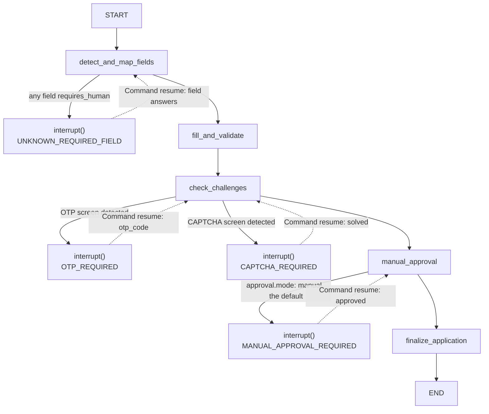

A **separate, standalone graph** from the Phase 3 supervisor above — not
spliced into `application_queue`'s processing. Section 4's full picture
shows one continuous pipeline from discovery through submission, but
wiring the two together needs a real `application_queue` → apply hand-off,
which is Phase 7's job (once there's a real portal to apply *to*). Keeping
Phase 6 standalone meant zero regressions to Phase 3/4's already-passing
tests while still proving the interrupt mechanics for real.

Implemented in `app/graph/`: `apply_state.py` (`ApplicationState`),
`apply_nodes.py` (5 nodes, linear, one job at a time — matching Section
24's conservative `application_concurrency: 1`), `apply_graph.py` (wiring
+ its own checkpointer, same allow-listed-msgpack pattern as the
supervisor graph), `apply_service.py` (backing `/api/applications`).

**No live browser `Page` is ever held across an `interrupt()`.** Every
node that touches the browser opens and closes it within that single call
— `interrupt()` can pause for an arbitrary amount of real time, possibly
across a process restart (Section 26), and a `Page` object cannot survive
either. Verified: `launch_browser()` is called fresh inside
`detect_and_map_fields_node`, `fill_and_validate_node`, and once per page
inside `check_challenges_node`'s loop — never held in `ApplicationState`
itself (which only stores plain data: `job`, `candidate_profile`,
`field_mappings`, page URLs).

**Sequential `interrupt()` calls within one node work as LangGraph's docs
imply but this repo hadn't exercised before Phase 6** — `check_challenges_node`
loops over `challenge_page_urls` and can call `interrupt()` once per
challenge page; each `Command(resume=...)` satisfies the next pending call
in order, with everything before it re-running deterministically (it's
pure) rather than re-pausing. Confirmed via a standalone probe before
committing to the design (see the multi-interrupt test scenarios in
`tests/e2e/test_apply_graph.py`).

**Manual approval always fires last and is the real Section 48 default**:
`manual_approval_node` reads `config/automation.yaml`'s `approval.mode`
(default `"manual"`) and interrupts showing every field about to be
submitted (`MANUAL_APPROVAL_REQUIRED`, carrying the full `field_mappings`
list) — "hybrid" mode's score-based auto-approval carve-out isn't
implemented yet (falls back to manual), since there's no real
`application_queue` driving this graph yet to have a score to check.
`"automatic"` mode skips the interrupt entirely.

**Dry-run is enforced at the very last step regardless of approval**:
`finalize_application_node` checks `AUTOMATION_DRY_RUN` (default `true`)
*after* approval, not before — an approved application still ends in
`dry_run_ready`, never `submitted_mock`, until dry-run is explicitly
turned off (Section 47). Verified live with a genuine process kill/restart
between an `OTP_REQUIRED` pause and its resume — same guarantee Phase 3
already proved for the unrelated score-review interrupt.

### First real portal adapter: Greenhouse (Phase 7)

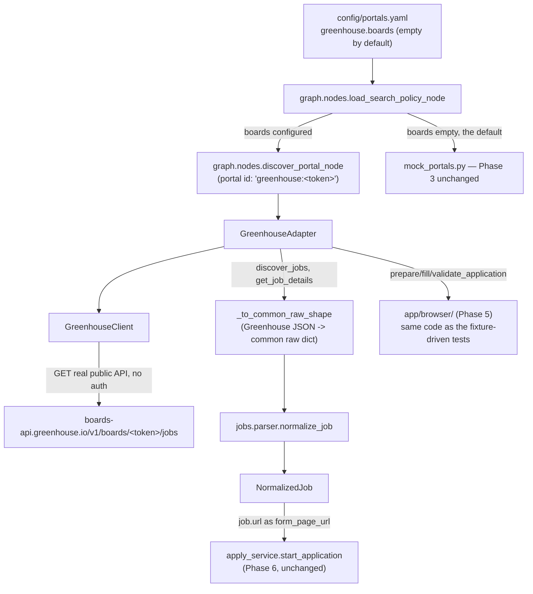

`app/portals/base/` (`JobPortalAdapter`, Section 9's exact interface —
note it's a *package*, `base/__init__.py`, not a `base.py` module; see the
README's "Notes for contributors" for why that distinction bit this phase)
and `app/portals/greenhouse/` (`client.py`, `adapter.py`).

**Discovery is real, not mocked** — `GreenhouseClient` calls
Greenhouse's actual public Job Board API
(`boards-api.greenhouse.io/v1/boards/<token>/jobs`), the same
official, unauthenticated, read-only endpoint every company running
their careers page on Greenhouse exposes for exactly this purpose
(Section 12: "prefer official/public APIs when available"). Verified
live against GitLab's real board: 201 real jobs, a real 7,579-character
job description via the real detail endpoint.

**`discover_jobs` returns Phase 3's common raw shape, not Greenhouse's
native one** — `_to_common_raw_shape` does that conversion inside the
adapter, so `app/graph/nodes.py`'s existing, already-tested
`normalize_jobs_node` handles jobs from any portal (mock or real)
identically, with zero changes to that node. `GreenhouseAdapter.normalize_job`
still exists separately per Section 9's interface (a thin wrapper around
the same shared `app.jobs.parser.normalize_job`), for direct/standalone
callers that don't go through the graph.

**Config-gated, default-off, by construction, not convention**:
`config/portals.yaml`'s `greenhouse.boards` ships as `[]`. `discover_portal_node`
still recognizes both `mock_*` portal ids and `greenhouse:<token>` ids
side by side — nothing about adding real-portal support required removing
or changing the mock-portal path, and a dedicated regression test
(`test_default_config_still_falls_back_to_mock_portals`) pins the fresh-
install default. This mattered here specifically because the automated
test suite runs against the *real* `config/` directory
(`CONFIG_DIR=./config`, same as production) rather than an isolated copy
— a non-empty default would have made CI depend on live network access.

**Application handling delegates to Phase 5/6, it doesn't reimplement
them**: `prepare_application`/`fill_application`/`validate_application`
call straight into `app/browser/forms.py` — the exact code already
exercised against local fixtures in `tests/e2e/test_form_engine.py`.
Verified live (read-only: navigate + `detect_fields`, no fill, no
submit) against GitLab's actual application page — 22 real fields
detected correctly, including a genuinely nuanced screening question
("subject to any employment agreements and/or post-employment
restrictions...?") that the Phase 5 mapper correctly left for a human
rather than guessing. One real gap this surfaced: Greenhouse splits
`first_name`/`last_name`, but `mapping.py`'s single "name" pattern
(matched against `resume.name`, which Phase 1 never splits either) maps
both to the same value — noted, not fixed here, since fixing it properly
means teaching Phase 1's parser a structured name, out of this phase's
scope.

**`submit_application` has no path to actually submitting anywhere.**
While `AUTOMATION_DRY_RUN=true` (the enforced default, Section 47) it
always returns `{"status": "dry_run_ready", "submitted": False}`; if
dry-run were ever turned off, it raises `NotImplementedError` rather than
silently doing nothing or, worse, guessing at a submit action — flipping
dry-run off is a deliberate, separate decision this codebase doesn't
implement a bypass for.

**Section 10's "one LangGraph subgraph per portal" isn't what got
built** — Phase 6's apply subgraph is already portal-agnostic (URL-driven:
`form_page_url`/`challenge_page_urls`), so it serves *every* portal,
Greenhouse included, without a dedicated Greenhouse subgraph. A real
discovered job's `job.url` feeds directly into the same
`apply_service.start_application` Phase 6 already built and tested — one
reusable graph rather than one per adapter. See the "Target portal
subgraph" diagram below for the originally-specified per-portal shape,
kept for reference.

### Dashboard: persistence + API + React frontend (Phase 8)

```mermaid
flowchart TB
    RunService["graph.service.start_run / resume_run\n(Phase 3, unchanged)"] -->|raw graph state,\nbefore _summarize()| Persistence[graph.persistence]
    ApplyService["graph.apply_service.start_application / resume_application\n(Phase 6, unchanged)"] -->|raw graph state| Persistence
    Persistence --> JobsTable[(jobs)]
    Persistence --> AppsTable[(applications)]
    Persistence --> RunsTable[(automation_runs)]
    Persistence --> InterventionsTable[(human_interventions)]

    JobsTable --> JobsAPI["GET /api/jobs, /api/jobs/{id}"]
    AppsTable --> AppsAPI["GET /api/applications"]
    RunsTable --> RunsAPI["GET /api/runs"]
    InterventionsTable --> HumanAPI["GET /api/human-actions"]
    HumanAPI -->|POST .../resolve, kind=run| RunResume["graph.service.resume_run"]
    HumanAPI -->|POST .../resolve, kind=application| AppResume["graph.apply_service.resume_application"]
    JobsTable --> AnalyticsAPI["GET /api/analytics/summary"]
    AppsTable --> AnalyticsAPI
    YamlLoader2[YamlConfigLoader] --> SettingsAPI["GET/PUT /api/settings"]

    JobsAPI --> Frontend["frontend/ (Vite + React + TS + Recharts)"]
    AppsAPI --> Frontend
    RunsAPI --> Frontend
    HumanAPI --> Frontend
    AnalyticsAPI --> Frontend
    SettingsAPI --> Frontend
```

**Persistence writes happen at the service layer, not inside the
graphs.** `graph/persistence.py`'s `persist_run_result`/
`persist_application_result` are called from `service.py`/
`apply_service.py` right after `graph.ainvoke(...)` returns, using the
*raw* state dict — `ScoredJob`/`NormalizedJob`/`MatchResult` Pydantic
objects — before each service's own `_summarize()` strips it down to the
small `RunResult`/`ApplicationResult` the API responds with. `nodes.py`
and `apply_nodes.py` are untouched: zero risk to the 178 tests those
phases already had passing, confirmed by re-running them after wiring
Phase 8 in.

**Two persistence mechanisms now coexist deliberately.** Phases 3/6's
LangGraph checkpointers (`AsyncSqliteSaver`) remain exactly as they
were — they're what makes `resume_run`/`resume_application` work at all,
including across a genuine process restart. The Phase 8 tables are a
separate, additive read model for the dashboard to list/filter/chart
completed and in-flight work; nothing here replaces or bypasses the
checkpointer.

**`jobs`/`job_scores` (Section 27) were merged into one `JobRecord`
table**, score fields inlined — same pragmatic-merge call Phase 1 made
for `candidate_profiles`/`resume_versions`, justified the same way: this
system scores a job once per discovery run, with no product need for
score history over time yet. See the updated ER diagram below.

**`human_interventions` is a queue view over two independent interrupt
sources, not a third interrupt mechanism.** `POST /api/human-actions/
{id}/resolve` inspects the stored `kind` (`"run"` or `"application"`) and
dispatches straight to `graph.service.resume_run` or
`graph.apply_service.resume_application` — the graph that owns the
interrupt still owns resuming it; this endpoint only unifies *listing*
pending work from both sources in one place for the dashboard.

**The Settings page edits `config/*.yaml` directly, not a database
table.** `GET`/`PUT /api/settings` read/write through the existing
`YamlConfigLoader` (Phase 0) — the same loader every other component
already uses — so a save takes effect on the *next* request with no
restart, matching the "config over code" principle below. A `PUT`
rewrites the target file wholesale via `yaml.safe_dump`; hand-written
comments in the shipped `config/*.yaml` files don't survive being edited
through this page.

**Analytics deliberately omits response rate, interview rate, and
average response time** (all three are in Section 32's original list).
Nothing in this codebase observes real employer responses — no inbound
email parsing, no webhook, no portal-status polling — so there is no
underlying signal for those numbers; showing them would mean fabricating
data, which the design principles below explicitly rule out.

**One real cross-database bug found and fixed here**: SQLite drops
tzinfo on read even for a `DateTime(timezone=True)` column, so a
freshly-read `JobRecord.discovered_at` compared directly against
`datetime.now(UTC)` raised `TypeError`. Fixed in
`app/api/routes/analytics.py::_as_utc` (re-attach UTC to a naive read,
safe since every datetime this app writes already is UTC) rather than in
the database layer — see the README's "Notes for contributors" for the
full writeup.

**Frontend is a from-scratch Vite + React + TypeScript app** (`frontend/`,
not part of the Python package) with `react-router-dom` for the six
pages and `recharts` for the Analytics charts. `api/client.ts` is a thin
typed `fetch` wrapper (no React Query / SWR — six pages of mostly
independent `GET`s didn't justify a data-fetching library), `hooks/
useAsync.ts` centralizes the loading/error/reload pattern every page
needs. Verified live end-to-end with a real Playwright browser
(reusing the same `playwright` dependency Phases 5-6 already use, just
pointed at the running Vite dev server instead of an HTML fixture): a
real discovery run, a real two-interrupt application (an unrecognized
field, then manual approval) resolved through the actual Human Review
UI — including confirming that resolving one interrupt can immediately
surface the next one rather than completing the application, which the
UI's per-reason resolver components handle by simply re-rendering
against whatever `GET /api/human-actions` returns next.

### Scheduler + notifications (Phase 9)

```mermaid
flowchart TB
    Lifespan["app.main lifespan\n(startup)"] --> SchedulerService[SchedulerService]
    SchedulerService --> APScheduler["AsyncIOScheduler\n(one process-wide instance)"]

    AutomationYaml["config/automation.yaml\nscheduler: enabled/timezone/schedules/daily_summary_hour"] --> SchedulerService

    APScheduler -->|CronTrigger / IntervalTrigger, one per schedule| DiscoveryJob["_run_discovery_job()"]
    APScheduler -->|CronTrigger, hour=daily_summary_hour| SummaryJob["_daily_summary_job()"]

    DiscoveryJob -->|same entrypoint as POST /api/runs| StartRun["graph.service.start_run()"]
    SummaryJob --> AnalyticsService["analytics.service.compute_summary()"]

    StartRun -->|run completed/failed/human review| NotifyAll["notifications.service.notify_all()"]
    StartApp["apply_service.start_application/resume_application"] -->|application submitted/failed/human review| NotifyAll
    SummaryJob --> NotifyAll

    NotifyAll --> Console[ConsoleNotificationProvider]
    NotifyAll --> Webhook[WebhookNotificationProvider]
    NotifyAll --> Email[EmailNotificationProvider]
    NotifyAll --> Desktop[DesktopNotificationProvider]

    NotificationsYaml["config/notifications.yaml\nproviders.*.enabled"] --> NotifyAll

    SettingsPut["PUT /api/settings\n(automation section)"] -->|reload()| SchedulerService
```

**Scheduling is deliberately independent from LangGraph** (Section 34):
every scheduled job calls `graph.service.start_run()` — the exact same
function `POST /api/runs` calls — with zero knowledge of graph
internals, nodes, or checkpointing. A scheduled run behaves identically
to a manual one: same scoring, same guardrails, same human-review pause,
same persistence.

**One process-wide `AsyncIOScheduler`, started once in `app.main`'s
lifespan.** `SchedulerService.reload()` — called at startup and again
whenever `PUT /api/settings` writes a new `automation` section — removes
every job and re-registers from the current config, so a schedule edit
takes effect immediately, no restart, the same pattern every other
config-editable behavior in this app follows. `enabled: false` (the
shipped default) means `reload()` registers zero jobs; "manual
execution" (`POST /api/runs` directly) is unaffected either way.

**Cron and interval are the only two trigger shapes** (matching Section
34's example config exactly) — "daily execution," "specific weekdays,"
and "business-hour execution" are all just cron-expression use cases
(`"0 9 * * *"`, `"0 9 * * 1-5"`, `"0 9-17 * * 1-5"`), so no separate
schema exists for them. No timing randomization was added anywhere in
this — the spec explicitly rules out building jitter intended to evade
detection.

**The daily-summary job reuses the same computation the dashboard's
`GET /api/analytics/summary` calls** — `app/analytics/service.py` was
extracted from Phase 8's route handler specifically so both call sites
share one implementation rather than the scheduler duplicating query
logic.

**Notifications are a thin, provider-agnostic abstraction**
(`NotificationProvider.notify(event)`) fanned out by
`notifications.service.notify_all`, which catches and logs each
provider's exception independently — a bad webhook URL or an
unreachable SMTP server never blocks Console (or any other channel)
from firing. Console is the only channel enabled by default
(`config/notifications.yaml`), consistent with "no paid API key
required for the basic install"; Webhook/Email/Desktop are opt-in.
Email uses the stdlib `smtplib` (no new dependency, sent via
`asyncio.to_thread` since it's synchronous); Desktop shells out to
`notify-send` and no-ops wherever it isn't on `PATH` rather than adding
a cross-platform GUI-notification dependency for one optional channel.

**Notification events fire from the service layer, not the graphs** —
`graph/service.py`'s `start_run`/`resume_run` and
`graph/apply_service.py`'s `start_application`/`resume_application` each
call `notify_all` once, after summarizing the graph's result, mapping
`waiting_human` → `HUMAN_INTERVENTION_REQUIRED`, a non-empty `errors`
list → `RUN_FAILED`/`APPLICATION_FAILED`, and a real completion →
`RUN_COMPLETED`/`APPLICATION_SUBMITTED`. A human's own
`rejected_by_human` decision sends no notification — they already know
what they decided.

**One real bug found here**: APScheduler's `Job.next_run_time` is
declared in `__slots__`, so reading it on a job added before the
scheduler has actually started raises `AttributeError` rather than
returning `None` — `SchedulerService.list_jobs()` uses
`getattr(job, "next_run_time", None)` to guard against this. See the
README's "Notes for contributors" for the full writeup.

**Verified live**: a real 25-second `interval` schedule fired two real
discovery runs back to back; console log lines and a real webhook POST
(captured by a local HTTP receiver) both carried the correct
`human_intervention_required` and `run_completed` event payloads; the
daily-summary job produced a correct summary from real data when
invoked directly; an application's `application_submitted` notification
fired after approval; and a live `PUT /api/settings` disabling the
scheduler mid-run was confirmed to stop further runs from firing.

### Additional portals: Lever + the portal registry (Phase 10)

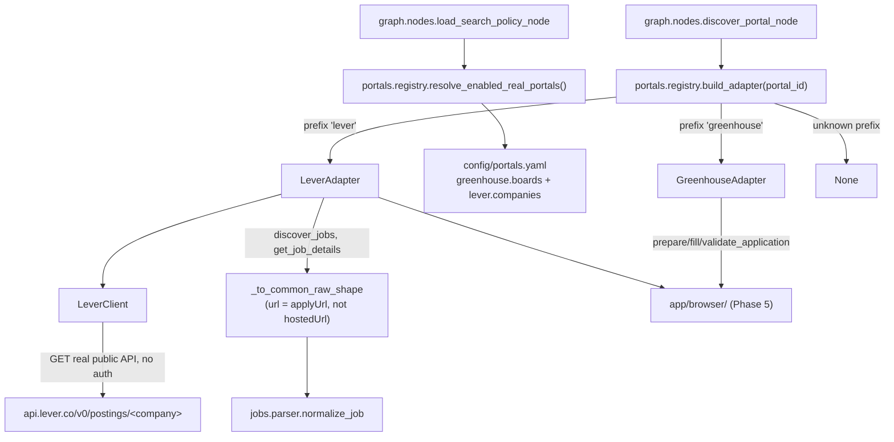

**The supervisor was already hardcoding one portal — Phase 10 fixed
that before adding a second.** Phase 7's `discover_portal_node` and
`load_search_policy_node` each had a `portal.startswith("greenhouse:")`
branch written directly into `app/graph/nodes.py`. Adding Lever the same
way would have meant a second, near-identical branch — exactly what
Phase 10 explicitly rules out ("add each portal as an isolated
adapter/subgraph... do not modify the supervisor for every new
portal"). `app/portals/registry.py` — a plain
`dict[str, PortalRegistration]`, `{prefix: (identifiers_key, adapter
factory)}` — replaces both branches with two generic calls
(`resolve_enabled_real_portals`, `build_adapter`); `nodes.py` no longer
imports any concrete adapter class at all. A third portal needs a new
`app/portals/<name>/` module plus one registry entry, nothing in
`nodes.py`.

**Discovery is real, via the same "official public API" pattern as
Greenhouse** — `LeverClient` calls
`api.lever.co/v0/postings/<company>?mode=json`, the same unauthenticated
endpoint `jobs.lever.co/<company>`'s own embed widget reads from.
Verified live against Lever's own public demo board (`leverdemo`): 388
real postings.

**`discover_jobs` returns the same common raw shape Greenhouse's adapter
does**, so `normalize_jobs_node` needs zero portal-specific handling —
identical to the Phase 7 design.

**One real bug found and fixed by live-verifying, not by trusting field
names**: Lever splits a posting's descriptive page (`hostedUrl`,
confirmed zero `<form>` elements) from its actual application form
(`applyUrl`). `_to_common_raw_shape` sets `NormalizedJob.url` to
`applyUrl` — using the more innocuous-looking `hostedUrl` would have
produced an adapter that looked correct (real jobs, real descriptions)
but detected 0 fields on every real application attempt, since
`prepare_application` navigates straight to `job.url`. `hostedUrl` is
kept in `metadata["posting_url"]` for anyone wanting the human-readable
page instead. A second bug in the same live-verification pass: Lever's
`createdAt` is epoch *milliseconds*, and passing it straight to a
Pydantic `datetime` field (which treats a bare number as epoch
*seconds*) lands on a date in the year 51157 —
`_epoch_ms_to_iso` divides by 1000 first. See the README's "Notes for
contributors" for both.

**Field detection and mapping verified against Lever's real application
form**, not just discovery: 50 real fields on the live `leverdemo`
apply page, including a full EEO/demographic set (pronouns, gender,
race/ethnicity, veteran status, disability status) — exactly the
sensitive categories Section 18/`SECURITY.md` require a human for. Only
`name`/`email`/`phone` were auto-mapped from the candidate profile; all
46 remaining fields, including every sensitive one, correctly came back
`requires_human=True`. This is the richest real sensitive-field form
exercised in this codebase so far (more categories than GitLab's
Greenhouse form in Phase 7).

**`submit_application` has no path to actually submitting**, same as
Greenhouse: `{"status": "dry_run_ready", "submitted": False}` while
`AUTOMATION_DRY_RUN=true`, `NotImplementedError` otherwise.

**Workday, LinkedIn, Naukri, and Indeed remain unimplemented.** None
expose a comparable official, unauthenticated, scrape-free public API —
Section 12 ("prefer official/public APIs when available... respect
portal terms") is why Greenhouse and Lever specifically were the two
adapters built, not an arbitrary subset of the originally-listed
`portals/` directory (`base/, greenhouse/, lever/, workday/, linkedin/,
naukri/, indeed/`).

### LLM integration: provider, router, embeddings, prompts (Sections 36-39)

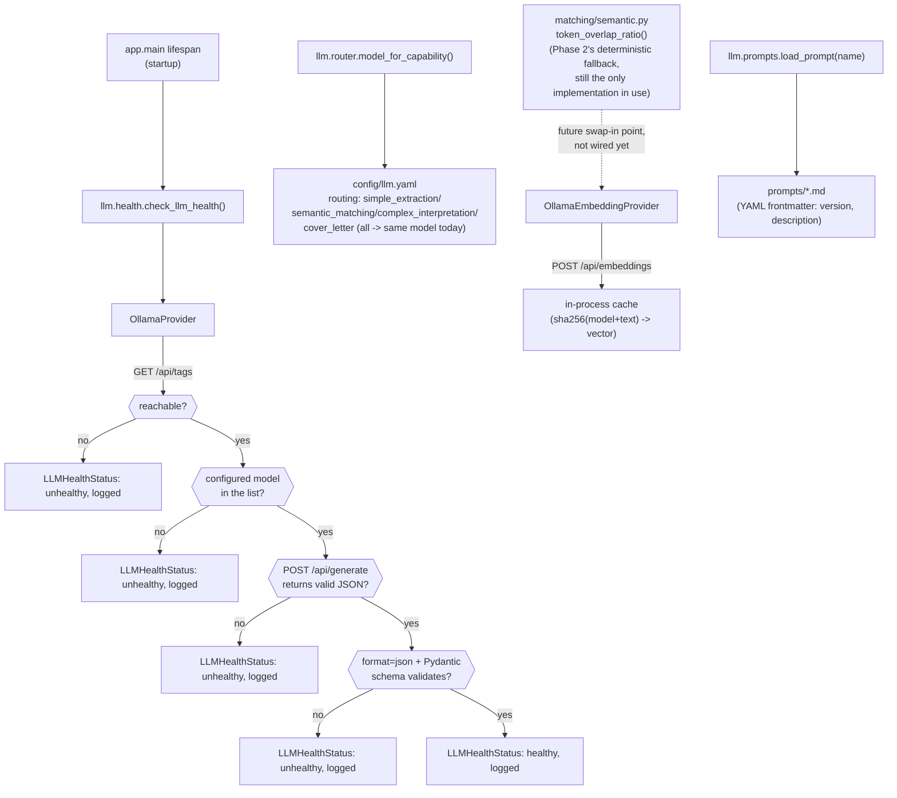

**Real, working infrastructure — genuinely unverified against a real
model.** Every piece here is functional code with real tests, not a
stub: `OllamaProvider` makes real HTTP requests shaped exactly like
Ollama's actual `/api/tags`/`/api/generate` contract, `format: "json"`
plus Pydantic `model_validate` for structured output (never a bare
dict), `OllamaEmbeddingProvider` the same against `/api/embeddings`
with an in-process cache keyed by a content hash. But no Ollama instance
was installed in this project's development environment, so every
`app/llm/` test (`tests/unit/test_llm_*.py`) mocks the HTTP layer rather
than exercising a real model's actual behavior — unlike Phase 7/10's
portal adapters, which were verified against real, live, unauthenticated
public APIs. The one piece of this that *is* verified against real
conditions, not a mock, is exactly the failure mode a fresh install
without Ollama hits: `tests/integration/test_app_startup.py` runs the
actual `app.main.lifespan` against this environment's genuine absence of
Ollama and confirms it starts cleanly.

**Health checks fail closed, never crash** (Section 36's explicit
requirement). `check_llm_health` short-circuits at the first failing
stage (unreachable → skip every later check; model missing → skip JSON/
schema checks) and always returns an `LLMHealthStatus`, never raises —
`app.main`'s lifespan wraps even that call in a broad `except Exception`
as defense in depth, so a genuinely unexpected failure inside the health
check itself still can't take the app down.

**Nothing outside `app/llm/` calls into any of this yet.** The obvious
integration point — `app/matching/semantic.py`'s `token_overlap_ratio`,
explicitly built in Phase 2 "with the same shape an embedding-based
implementation would have, so swapping it in later doesn't require
changing any caller" — remains unswapped. Its only caller,
`app/matching/title.py`, runs synchronously inside `score_job()`;
threading a real async `EmbeddingProvider` call through that path is a
genuine refactor of already-tested Phase 2 code, deliberately left for
when a concrete need justifies it rather than bundled into building the
LLM plumbing itself. The seven `prompts/*.md` templates
(`resume_parser`, `job_parser`, `job_matcher`, `form_classifier`,
`answer_generator`, `cover_letter`, `supervisor`) are real, usable
prompt assets — each includes an explicit frontmatter note on what code
path it's meant for and that none is wired up yet. Every one that drafts
candidate-facing content (`answer_generator`, `cover_letter`) is written
to explicitly forbid inventing facts not in the candidate's profile,
matching SECURITY.md's "never fabricate candidate information."

**Design principle unaffected**: Section 2 ("LLM only where semantic
interpretation is required") still holds throughout this codebase.
Building the infrastructure to *support* an LLM call is not the same
decision as routing an actual scoring, matching, guardrail, or
extraction decision through one — none of those decisions do today.

### CLI (Section 46)

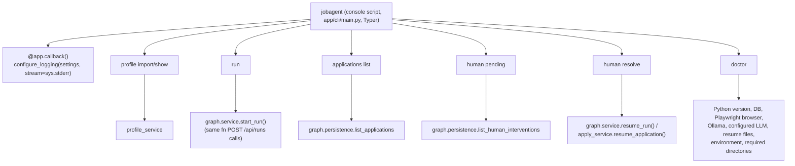

**Every command calls the same service function its HTTP-route
equivalent calls — nothing is reimplemented.** `jobagent run` *is*
`graph.service.start_run()`, the identical function `POST /api/runs`
invokes; `jobagent human resolve` dispatches to `resume_run`/
`resume_application` exactly like `POST /api/human-actions/{id}/
resolve` does. The CLI runs as a plain Python process — no FastAPI
server, no HTTP round trip — reading the same env vars and `config/
*.yaml` any other entrypoint does.

**Two real bugs in `app/core/logging.py`, both found by the CLI's own
tests, neither specific to the CLI.** First: `configure_logging()`
defaulted every log line to stdout unconditionally — harmless for the
server (its stdout is its whole log stream) but broken for a CLI whose
stdout is meant to be parseable product output; a notification's
console log line landing inside what should have been clean JSON broke
`jobagent run | jq`. Fixed with a `stream` parameter, defaulting to
stdout (server behavior unchanged) with the CLI passing `stream=sys.
stderr`. Second, and more interesting: `cache_logger_on_first_use=True`
meant that once *any* module-level `logger = get_logger(__name__)`
anywhere in the codebase had logged once, it permanently cached
whatever stream was configured at that moment — so a second
`configure_logging()` call in the same process (which `jobagent`'s
startup callback does, by design, once per invocation) could leave an
*unrelated* logger holding a reference to a stream a completed
invocation had already closed. This is a real latent risk independent
of the CLI (anywhere `configure_logging()` might run more than once in
a process), just not previously exercised — the CLI's tests
(`CliRunner` running many invocations in one shared process) were the
first code path to actually trigger it. Fixed by setting
`cache_logger_on_first_use=False`; see the README's "Notes for
contributors" for the full diagnosis, including why a per-test
`structlog.reset_defaults()` looked like a fix but wasn't (it resets
global config, not an already-populated per-logger cache).

### Central error handling (Section 40)

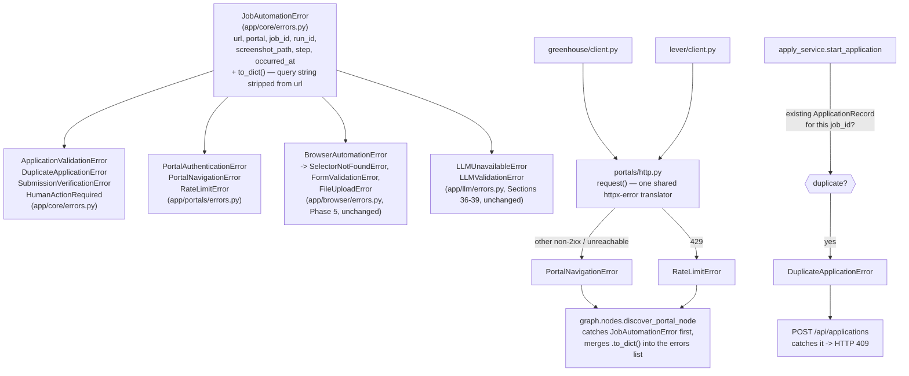

**This closes a gap Phase 5 itself flagged and never followed through
on.** `app/browser/errors.py`'s original docstring said "full portal/
application exceptions land in Phase 7 once there's a real portal to
raise them against" — Phase 7 (Greenhouse) shipped without them, and it
went unnoticed until this pass. `app/core/errors.py`'s
`JobAutomationError` is now the one shared base every exception in the
codebase inherits from — browser-level (`BrowserAutomationError`,
unchanged behaviorally, now richer), LLM-level (`LLMUnavailableError`/
`LLMValidationError`, same), and the portal/application-level ones this
pass actually adds.

**One shared HTTP-error translator, not one per portal.**
`app/portals/http.py::request()` wraps every real HTTP call both
`GreenhouseClient` and `LeverClient` make — a 429 becomes
`RateLimitError`, any other non-2xx or connection failure becomes
`PortalNavigationError` — so a third portal's client gets this behavior
by routing through the same function, not by reimplementing the
try/except. Verified live against both real APIs (an invalid board
token, an invalid company) rather than mocks alone.

**`DuplicateApplicationError` is a genuine new guardrail, not just a
new exception type.** `apply_service.start_application` previously had
no check at all — calling it twice for the same job created two
unrelated `ApplicationRecord`s. It now checks
`persistence.get_application_by_job_id` first (Section 50: "before
submitting, check existing application") and raises rather than
duplicating; `POST /api/applications` catches it and returns `409`.
Verified live: two real API calls for the same job, the second
correctly rejected.

**Never a credential.** `JobAutomationError.to_dict()` strips the query
string from any captured `url` before returning it — the most common
place a secret accidentally ends up in a URL — and no field in the
base class is ever credential-shaped to begin with (matching
`SECURITY.md`'s existing redaction discipline for logs).

**Three subclasses are defined but not raised anywhere, each
documented with exactly why**: `ApplicationValidationError` (the apply
graph deliberately treats invalid fields as a warning + human review,
not a hard failure — changing that is a bigger behavioral decision than
adding an exception type), `SubmissionVerificationError` (no code path
submits anything for real yet — `AUTOMATION_DRY_RUN=true` is enforced
everywhere), and `HumanActionRequired` (the graph's own `interrupt()`
already solves this better than a plain exception could — pausing with
checkpointed, resumable state).

### Hybrid approval mode (Section 48)

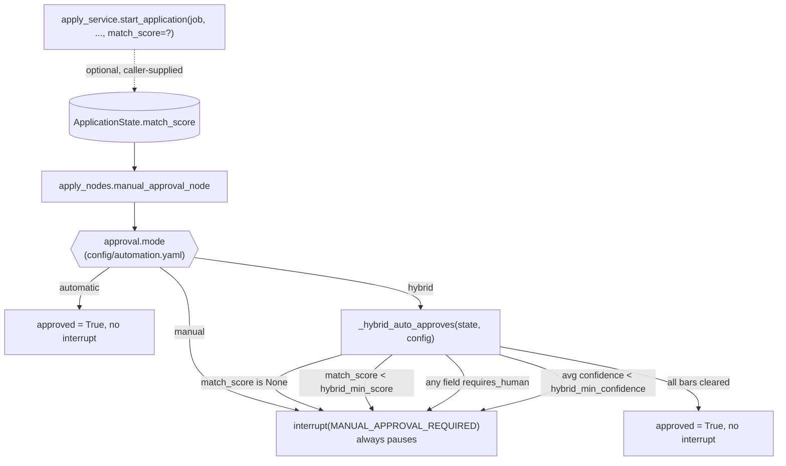

**Closes a gap Phase 6 explicitly flagged and left for later.**
`manual_approval_node`'s original comment said exactly this: "Phase 6
doesn't yet implement hybrid's score/confidence auto-approval carve-out
(Section 48); that's a Phase 7+ refinement once there's a real
application queue driving this graph." No later phase ever came back to
it until now.

**`match_score` is optional, caller-supplied — the apply graph still
doesn't compute one itself.** `ApplicationState` (Phase 6, deliberately
independent of the discovery/scoring graph's state — see that module's
docstring) gains one new optional field. Bridging the two graphs so a
queued job's own score flows in automatically is future work; today a
caller (the API's `StartApplicationRequest.match_score`) supplies it or
doesn't. A missing score always falls through to the same manual-review
`interrupt()` "manual" mode uses — Section 17's "never guessed" applies
here exactly as it does to candidate data.

**All three bars must clear, not just the score.** `_hybrid_auto_approves`
requires: a `match_score` at or above `hybrid_min_score` (default 90),
zero fields left `requires_human` (an unmapped/low-confidence field
always forces manual review regardless of score), and the average
confidence across every auto-filled field at or above
`hybrid_min_confidence` (default 0.85). Both thresholds are config, not
code (`config/automation.yaml`).

**Verified live, not just via the unit-level `_hybrid_auto_approves`
tests and the real-graph e2e tests.** A live API call with a 95.0 score
against a job whose fields all auto-mapped came back `"status":
"completed"` with no interrupt at all; the identical job with no score
supplied came back `"status": "waiting_human"`,
`"reason": "MANUAL_APPROVAL_REQUIRED"` — same code path, the presence
of a score being the only difference.

### Docker Compose frontend service (Section 45)

`docker-compose.yml` had `backend`/`postgres`/`redis` since Phase 0 but
no `frontend` service — Phase 8 built the dashboard without ever adding
it to the optional Docker path. `frontend/Dockerfile` is a standard
two-stage build: a `node:20-alpine` stage runs `npm ci && npm run
build`, then an `nginx:alpine` stage serves the resulting `dist/`
static files. `VITE_API_BASE_URL` is passed as a build arg
(`ARG`/`ENV` in the Dockerfile) rather than read at container runtime,
because Vite bakes `import.meta.env.VITE_*` values into the built JS
bundle at build time — there is no runtime env var to read inside the
nginx container. The value must be a URL the *browser* can reach (the
backend's published host port, `http://localhost:8000` by default), not
an internal Docker Compose DNS name like `http://backend:8000`, since
the frontend's JS runs in the user's browser, outside the Docker
network entirely. The container publishes port 80 as host port 5173 —
the same origin (`http://localhost:5173`) the CORS allowlist in
`app/main.py` already permits for the plain `npm run dev` path, so no
CORS change was needed.

**Verified by actually building and running the image**, not just
`docker compose config` parsing successfully: `docker build
./frontend` completed a real multi-stage build, the resulting container
served real HTML on port 5173 with a 200, and the built JS bundle was
grepped to confirm `http://localhost:8000` (the default
`VITE_API_BASE_URL`) was genuinely baked in.

### Target LangGraph workflow (Phase 3 done through Guard; rest planned)

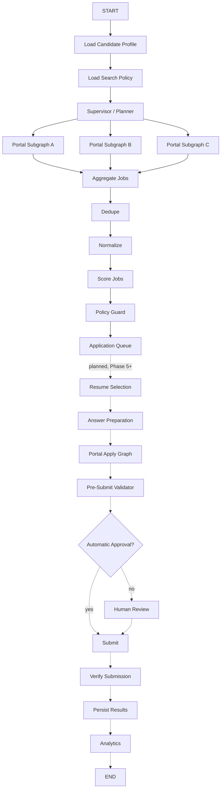

Note: implemented dedupe runs *after* normalize (needs title-family
canonicalization — Section 14's own "normalized title" matching key),
whereas this narrative diagram (carried over from the original design spec)
shows it before. See `app/graph/nodes.py::dedupe_jobs_node` for the
reasoning.

## Target portal subgraph (as originally specified; superseded by the
generic apply subgraph — see Phase 6/7 above)

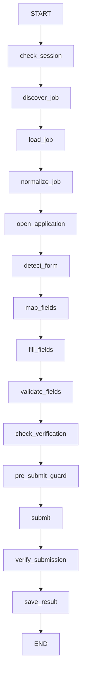

This called for one dedicated LangGraph subgraph per portal. What actually
got built (Phase 6) is a single, portal-agnostic apply subgraph
parameterized by URL — every step above (`detect_form`→`map_fields`→
`fill_fields`→`validate_fields` here maps to Phase 6's
`detect_and_map_fields`/`fill_and_validate`; `check_verification` maps to
`check_challenges`; `pre_submit_guard` maps to `manual_approval`) exists,
just shared across every portal instead of duplicated per portal. A
portal *discovery* failure still never terminates the supervisor run
(`discover_portal_node` catches and logs, per portal, mock or real) —
that part of the original design held exactly as specified.

## Target application state machine (planned)

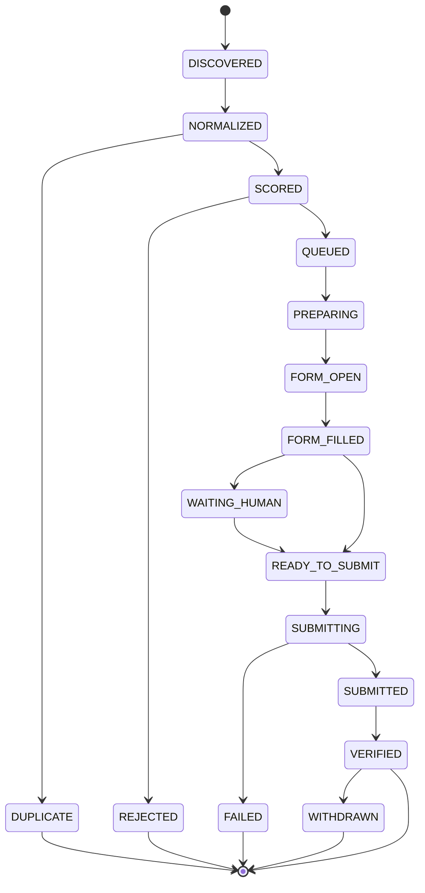

## Human-in-the-loop flow

Five real interrupt reasons exist today, across two graphs: the Phase 3
supervisor pauses when a job scores in the `human_review` band
(`/api/runs/{id}/resume`); the Phase 6 apply subgraph pauses for
`UNKNOWN_REQUIRED_FIELD`, `OTP_REQUIRED`, `CAPTCHA_REQUIRED`, and
`MANUAL_APPROVAL_REQUIRED` (`/api/applications/{id}/resume`). A dedicated,
unified `/api/human-actions` review queue spanning both graphs is still
planned — today each graph's own resume endpoint is authoritative for its
own interrupts. The mechanism (persist → notify → resolve → resume) is
identical across all five; only the *reason* and which endpoint handles it
differ.

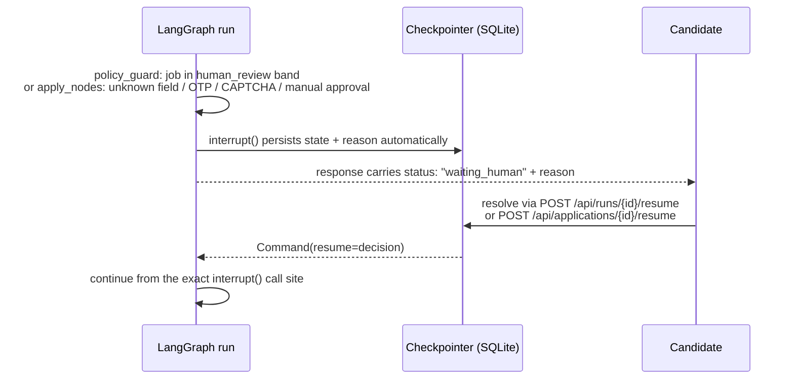

## Database relationships

```mermaid
erDiagram
    CANDIDATE_PROFILES ||--o{ RESUME_VERSIONS : "has (planned)"
    CANDIDATE_PROFILES ||--o{ COVER_LETTER_VERSIONS : "has (planned)"
    AUTOMATION_RUNS ||--o{ JOBS : discovers
    JOBS ||--o{ APPLICATIONS : applied_via
    APPLICATIONS ||--o{ APPLICATION_STEPS : "consists_of (planned)"
    APPLICATIONS ||--o{ APPLICATION_ANSWERS : "contains (planned)"
    APPLICATIONS }o--|| PORTAL_ACCOUNTS : "uses (planned)"
    AUTOMATION_RUNS ||--o{ AGENT_RUNS : "contains (planned)"
    JOBS ||--o{ HUMAN_INTERVENTIONS : "may_trigger (kind=run)"
    APPLICATIONS ||--o{ HUMAN_INTERVENTIONS : "may_trigger (kind=application)"
    APPLICATIONS ||--o{ AUDIT_EVENTS : "logs (planned)"
```

Phase 0 shipped only the async engine/session foundation
(`app/database/base.py`, `app/database/session.py`) and Alembic wiring
(`migrations/`) — no tables. Phase 1 added `candidate_profiles`
(migration `99cc354684f4`), a simplified single-row version of the planned
`CANDIDATE_PROFILES`/`RESUME_VERSIONS`/`COVER_LETTER_VERSIONS` split above —
resume and cover-letter data live as JSON/text columns on one row rather
than versioned child tables, since there's exactly one local candidate and
no version history yet. Phase 2 needed no tables (it's a pure scoring
library). Phase 8 (migration `642a4deb1cf4`) added the four tables
actually shown above: `jobs` (Section 27's `JOBS`/`JOB_SCORES` merged
into one table, score fields inlined — same rationale as the Phase 1
merge), `applications`, `automation_runs`, and `human_interventions` (a
queue over both `jobs`-originated and `applications`-originated
interrupts — see Phase 8's section above). `APPLICATION_STEPS`/
`APPLICATION_ANSWERS`/`PORTAL_ACCOUNTS`/`AGENT_RUNS`/`AUDIT_EVENTS`
remain planned; nothing has needed them yet.

## Deployment architecture (planned)

```mermaid
flowchart LR
    subgraph LocalMachine [Candidate's machine]
        Backend[FastAPI backend]
        SQLite[(SQLite)]
        Ollama[Ollama]
        Frontend[React dashboard]
        Backend --> SQLite
        Backend --> Ollama
        Frontend --> Backend
    end
    subgraph OptionalProd [Optional production deployment]
        BackendP[FastAPI backend]
        Postgres[(PostgreSQL)]
        Redis[(Redis - optional)]
        BackendP --> Postgres
        BackendP -.-> Redis
    end
```

Docker Compose is not required for local development (`make dev` runs
everything directly); it exists for the optional production path.

## Design principles enforced by the codebase

- **LLM only where semantic interpretation is required.** Deterministic
  code owns salary checks, location filtering, duplicate detection,
  guardrails, retries, scheduling, and submission verification.
- **Config over code.** Candidate preferences, scoring weights, automation
  limits, and portal registration live in `config/*.yaml`, not Python.
- **Dry-run and manual approval by default.** See `SECURITY.md`.
- **No portal-specific fields leak into the common job model** — they live
  under `NormalizedJob.metadata` (introduced Phase 2).
- **The supervisor orchestrates; it doesn't do the work.** `app/graph/graph.py`
  only wires nodes/edges/fan-out — DB access, scoring, and policy decisions
  are plain functions in `nodes.py` that the supervisor calls, never inline
  logic in the graph definition itself (Section 23).
- **A run's state is never only in Python memory.** Every graph invocation
  opens a fresh checkpointer connection to disk rather than holding one open
  for the process lifetime — proven by killing and restarting the server
  mid-run and still resuming correctly (introduced Phase 3).
- **Guardrails can only tighten an outcome, never loosen one.** The scorer
  proposes (Phase 2); guardrails dispose (Phase 4) — a check can downgrade
  `priority_apply` to `reject`, but nothing downstream can upgrade a
  guardrail's `BLOCK` back to `ALLOW` (Section 23).
- **Unknown is a distinct outcome from allowed or blocked.**
  `GuardrailDecision` is a three-value enum, not a bool — code can't
  accidentally treat "needs a human" the same as "denied" or "approved"
  (Section 17/18's fabrication-prevention rules depend on this distinction).
- **No feature develops against a live external site as its test
  environment.** Job discovery uses mock portals (Phase 3); the form
  engine uses local HTML fixtures (Phase 5, Section 42). Both are
  real code exercised by real automation (a real headless browser, a
  real LangGraph run) — only the *target* is local and disposable.
- **The system never solves what it must instead pause for.** CAPTCHA
  and OTP resume payloads are always a human's own input (a confirmation,
  a code read off their device) — never a solve attempt, a bypass, or a
  system-obtained value (Section 12, enforced in `apply_nodes.py`'s
  `check_challenges_node`).
- **A live resource is never held across an `interrupt()`.** The apply
  subgraph's nodes open and close the browser within a single node call;
  nothing that can't survive a process restart is ever stored in graph
  state (Section 26, Phase 6).
- **A portal adapter translates; it doesn't reimplement.** `GreenhouseAdapter`
  turns Greenhouse's real API shape into the shared common shape and then
  hands off to the exact same `app/browser/` code every fixture test
  already exercises — a second portal (Lever, Workday) means writing
  another translator, not another form-filling engine (Section 9, Phase 7).
- **A config default that would make CI depend on the live network is a
  bug, not a convenience.** `config/portals.yaml`'s `greenhouse.boards`
  ships empty specifically so the automated test suite — which reads the
  real `config/` directory, not an isolated copy — never silently starts
  requiring internet access (Phase 7).
