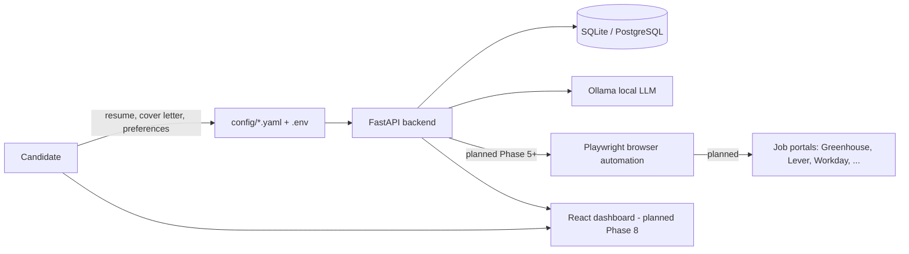
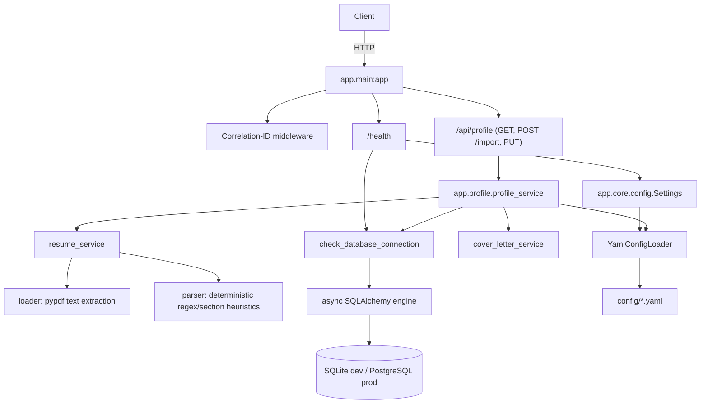
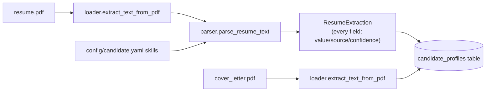
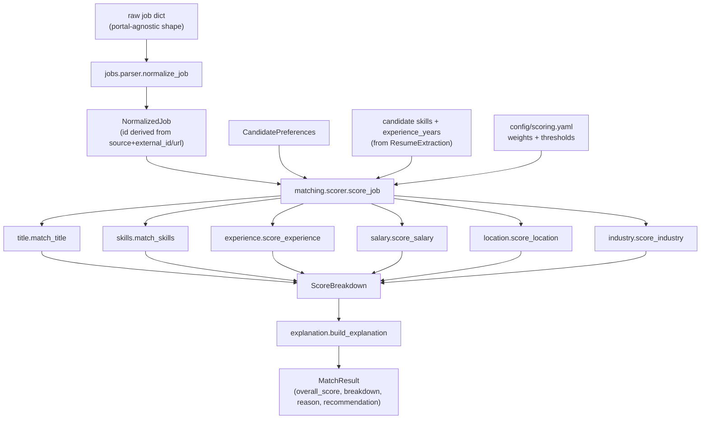
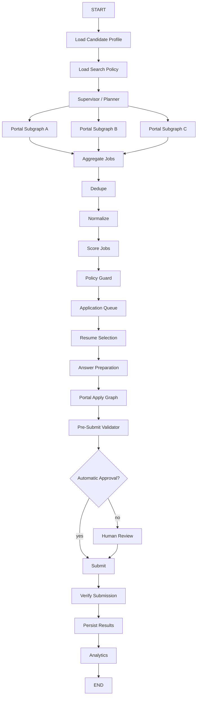
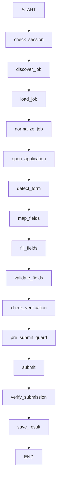
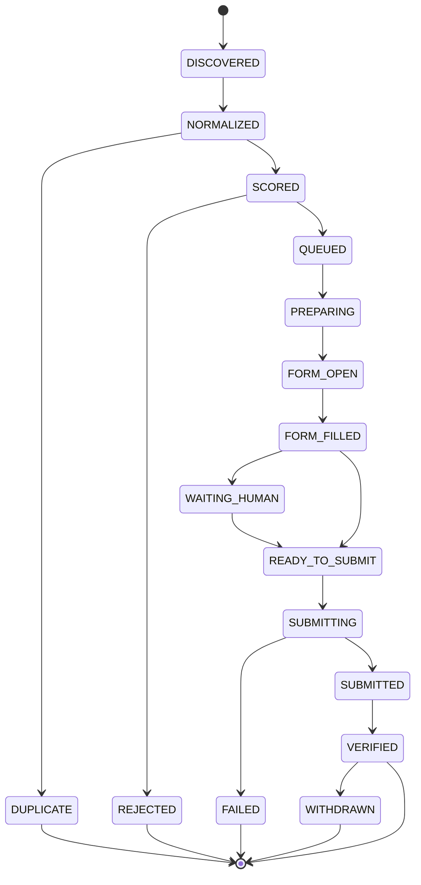
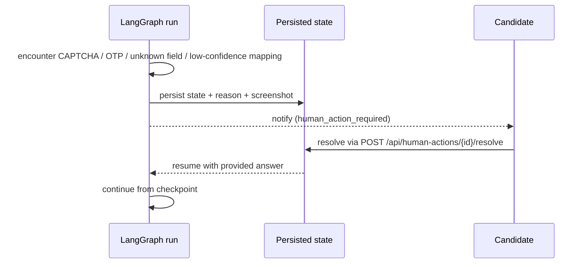
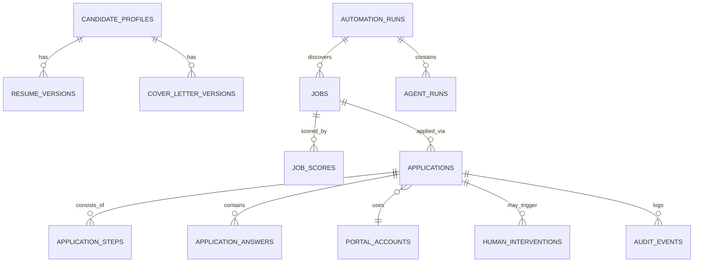
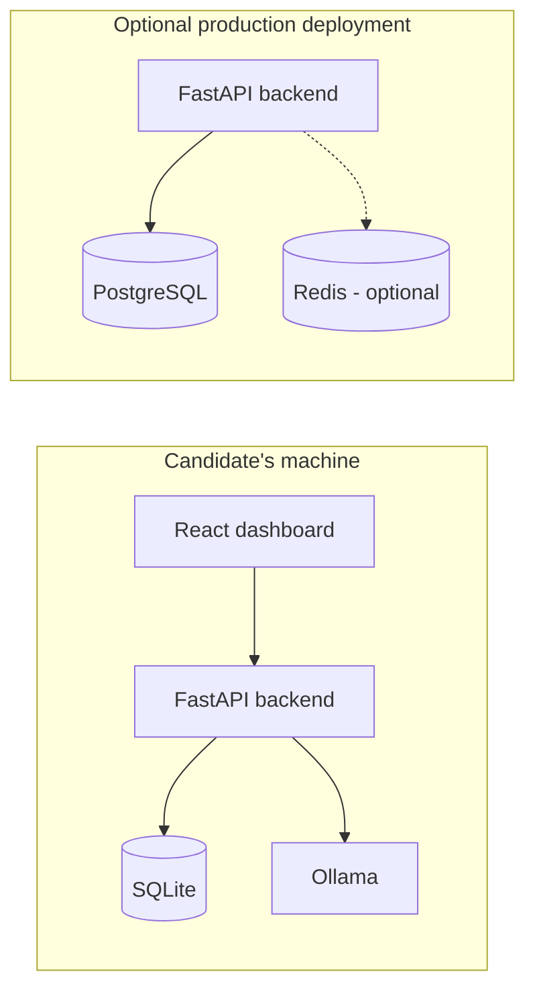

# Architecture

This document describes both the current (Phase 0-2) implementation and the
target architecture the project is being built toward, phase by phase. Where
a component is not yet implemented, it is marked **(planned)**.

## System context

## Current implementation (Phase 0-1)

Configuration is layered:

- **`Settings`** (`app/core/config.py`) — environment-driven (`.env`),
  process-level: database URL, LLM connection, dry-run/approval defaults.
- **`YamlConfigLoader`** — domain configuration under `config/*.yaml`
  (candidate preferences, scoring weights, search policy, automation
  limits, portal registry), with `${ENV_VAR}` interpolation and per-file
  caching.

Logging is JSON-structured (`structlog`), with a per-request correlation ID
bound via contextvars and a redaction processor that strips sensitive keys
(passwords, tokens, cookies, OTPs, secrets) before anything is emitted.

### Candidate profile (Phase 1)

Extraction is **deterministic, not LLM-based** — per Section 2 of the design
spec, resume "understanding" is an LLM capability, but the LLM isn't wired
up until Phase 6. So Phase 1's parser only populates fields a defensible
rule can produce (regex for email/phone/years-of-experience, section-header
scanning for education/certifications/languages/achievements, vocabulary
matching for skills). Fields that genuinely need semantic understanding
(previous titles, companies, industries) are left as
`{"value": null, "confidence": 0.0, "source": "unextracted"}` rather than
guessed — see Section 17 ("never invent information missing from the
resume"). A future LLM-backed extractor fills the same `ExtractedField`
schema with `source="llm"` without changing any downstream consumer.

The system is single-candidate/local-first: `candidate_profiles` has exactly
one row, addressed by the fixed id `"default"` (see
`app/database/models/candidate_profile.py`).

### Job model + matching engine (Phase 2)

Every sub-scorer is pure rule-based logic — no LLM, no embeddings. Section
16 calls for a hybrid model (`exact rules + keyword normalization + skill
aliases + embedding similarity + optional LLM review`); Phase 2 implements
the first three (`skills.py`'s alias table resolves e.g. "Amazon Web
Services" → "AWS"; `title.py`'s family table resolves "Chief Technology
Officer" → the "CTO" family). Embedding similarity (Section 38) and LLM
semantic review are later additions layered on top — `semantic.py`
currently provides a deterministic token-overlap fallback (used by
`title.py` for titles outside every known family) with the same shape an
embedding-based implementation would have, so swapping it in later doesn't
change any caller.

Scoring never invents data to fill gaps — a job that doesn't disclose a
salary or experience range scores that dimension neutrally rather than
being guessed at or penalized (Section 17). Weights (title 25 / skills 30 /
experience 15 / industry 10 / location 10 / compensation 10) and
recommendation thresholds (`priority_apply` ≥90, `normal_apply` ≥80,
`apply_if_capacity` ≥75, `human_review` ≥60, else `reject`) both come from
`config/scoring.yaml`, never hardcoded in Python.

`NormalizedJob` (`app/jobs/models.py`) is the common schema every portal
adapter will normalize into (Phase 7+); portal-specific fields go under
`metadata` rather than contaminating the shared model (Section 8). No
`jobs`/`job_scores` database tables exist yet — Phase 2 is a pure scoring
library, exercised directly in tests and the README example; persistence
arrives with the LangGraph pipeline in Phase 3, which is what actually
discovers and needs to store jobs.

## Target LangGraph workflow (planned, Phase 3+)

## Target portal subgraph (planned, Phase 7+)

A portal subgraph failure must never terminate the supervisor run — failures
are caught, logged, and the run continues with the remaining portals.

## Target application state machine (planned)

## Target human-in-the-loop flow (planned)

## Database relationships (planned, expanded per phase)

Phase 0 shipped only the async engine/session foundation
(`app/database/base.py`, `app/database/session.py`) and Alembic wiring
(`migrations/`) — no tables. Phase 1 adds the first one, `candidate_profiles`
(migration `99cc354684f4`), a simplified single-row version of the planned
`CANDIDATE_PROFILES`/`RESUME_VERSIONS`/`COVER_LETTER_VERSIONS` split above —
resume and cover-letter data live as JSON/text columns on one row rather
than versioned child tables, since there's exactly one local candidate and
no version history yet. Remaining tables are introduced as migrations in
the phases that need them — Phase 2 turned out to need none (it's a pure
scoring library with no discovery pipeline to persist yet); `jobs`/
`job_scores`/application tables arrive with the LangGraph pipeline in
Phase 3+, per Section 27 of the design spec.

## Deployment architecture (planned)

Docker Compose is not required for local development (`make dev` runs
everything directly); it exists for the optional production path.

## Design principles enforced by the codebase

- **LLM only where semantic interpretation is required.** Deterministic
  code owns salary checks, location filtering, duplicate detection,
  guardrails, retries, scheduling, and submission verification.
- **Config over code.** Candidate preferences, scoring weights, automation
  limits, and portal registration live in `config/*.yaml`, not Python.
- **Dry-run and manual approval by default.** See `SECURITY.md`.
- **No portal-specific fields leak into the common job model** — they live
  under `NormalizedJob.metadata` (introduced Phase 2).
