# Architecture

This document describes both the current (Phase 0-5) implementation and the
target architecture the project is being built toward, phase by phase. Where
a component is not yet implemented, it is marked **(planned)**.

## System context

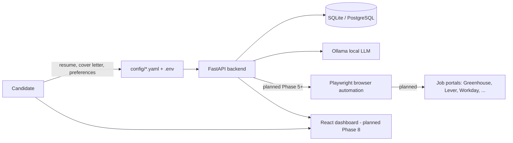

## Current implementation (Phase 0-5)

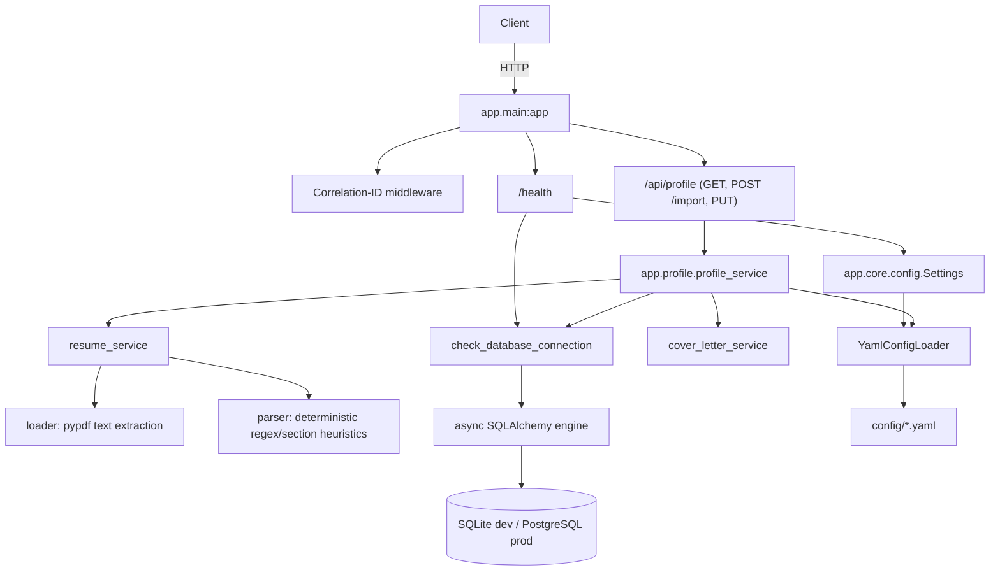

Configuration is layered:

- **`Settings`** (`app/core/config.py`) — environment-driven (`.env`),
  process-level: database URL, LLM connection, dry-run/approval defaults.
- **`YamlConfigLoader`** — domain configuration under `config/*.yaml`
  (candidate preferences, scoring weights, search policy, automation
  limits, portal registry), with `${ENV_VAR}` interpolation and per-file
  caching.

Logging is JSON-structured (`structlog`), with a per-request correlation ID
bound via contextvars and a redaction processor that strips sensitive keys
(passwords, tokens, cookies, OTPs, secrets) before anything is emitted.

### Candidate profile (Phase 1)

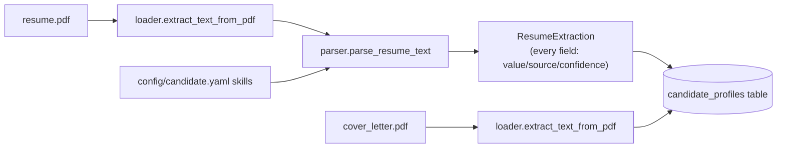

Extraction is **deterministic, not LLM-based** — per Section 2 of the design
spec, resume "understanding" is an LLM capability, but the LLM isn't wired
up until Phase 6. So Phase 1's parser only populates fields a defensible
rule can produce (regex for email/phone/years-of-experience, section-header
scanning for education/certifications/languages/achievements, vocabulary
matching for skills). Fields that genuinely need semantic understanding
(previous titles, companies, industries) are left as
`{"value": null, "confidence": 0.0, "source": "unextracted"}` rather than
guessed — see Section 17 ("never invent information missing from the
resume"). A future LLM-backed extractor fills the same `ExtractedField`
schema with `source="llm"` without changing any downstream consumer.

The system is single-candidate/local-first: `candidate_profiles` has exactly
one row, addressed by the fixed id `"default"` (see
`app/database/models/candidate_profile.py`).

### Job model + matching engine (Phase 2)

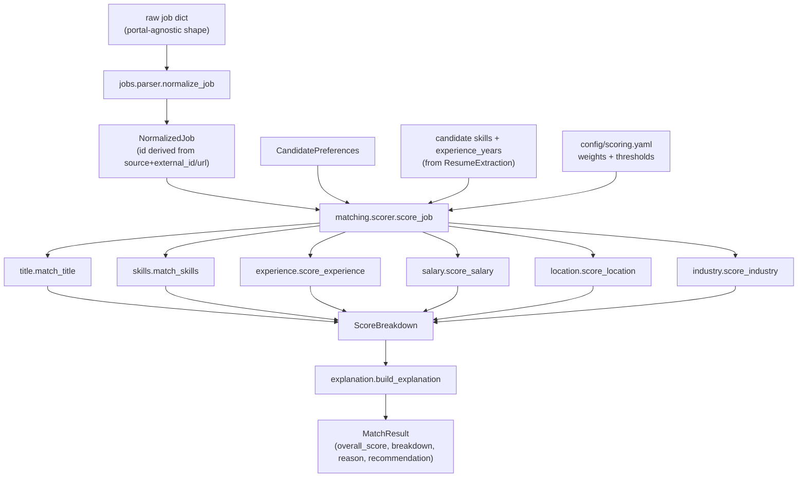

Every sub-scorer is pure rule-based logic — no LLM, no embeddings. Section
16 calls for a hybrid model (`exact rules + keyword normalization + skill
aliases + embedding similarity + optional LLM review`); Phase 2 implements
the first three (`skills.py`'s alias table resolves e.g. "Amazon Web
Services" → "AWS"; `title.py`'s family table resolves "Chief Technology
Officer" → the "CTO" family). Embedding similarity (Section 38) and LLM
semantic review are later additions layered on top — `semantic.py`
currently provides a deterministic token-overlap fallback (used by
`title.py` for titles outside every known family) with the same shape an
embedding-based implementation would have, so swapping it in later doesn't
change any caller.

Scoring never invents data to fill gaps — a job that doesn't disclose a
salary or experience range scores that dimension neutrally rather than
being guessed at or penalized (Section 17). Weights (title 25 / skills 30 /
experience 15 / industry 10 / location 10 / compensation 10) and
recommendation thresholds (`priority_apply` ≥90, `normal_apply` ≥80,
`apply_if_capacity` ≥75, `human_review` ≥60, else `reject`) both come from
`config/scoring.yaml`, never hardcoded in Python.

`NormalizedJob` (`app/jobs/models.py`) is the common schema every portal
adapter will normalize into (Phase 7+); portal-specific fields go under
`metadata` rather than contaminating the shared model (Section 8). No
`jobs`/`job_scores` database tables exist — Phase 3 persists run state via
the LangGraph checkpointer (below) rather than dedicated SQL tables; a
`jobs` table arrives if/when something other than a single in-flight run
needs to query historical jobs (e.g. the Phase 8 dashboard).

### LangGraph supervisor (Phase 3)

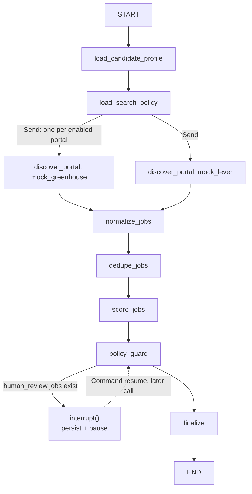

Implemented in `app/graph/`: `state.py` (`JobAutomationState`, a `TypedDict`
with `Annotated[list, operator.add]` reducers so parallel portal nodes
accumulate into `discovered_jobs` without clobbering each other — Section
24's fan-out, done via LangGraph's `Send` API rather than manual
asyncio.gather), `nodes.py`, `mock_portals.py` (two fixture portals
standing in for Phase 7's real adapters — one deliberately shares a job
with the other, company/title-family/location-identical, to exercise cross-
portal dedupe), `graph.py` (wiring + the SQLite checkpointer), and
`service.py` (`start_run`/`resume_run`/`get_run_state`, backing
`/api/runs`).

**The interrupt is real, not a stub**: `policy_guard` calls LangGraph's
`interrupt()` when any job scores in the `human_review` band (60–74).
Everything before that call re-runs identically on resume (it's pure/
deterministic), then the call returns the human's decision instead of
pausing again. Verified manually end-to-end including a genuine process
restart between pause and resume (kill the server, start a new one, `POST
/api/runs/{id}/resume` still works) — see the README's
"Running a discovery pipeline" section.

Deliberately deferred to later phases: resume selection, answer
preparation, the portal apply graph, submission, and verification (Phase
5-7); analytics (Phase 8). The diagram below shows where Phase 3 fits in
the full target picture.

### Guardrail engine (Phase 4)

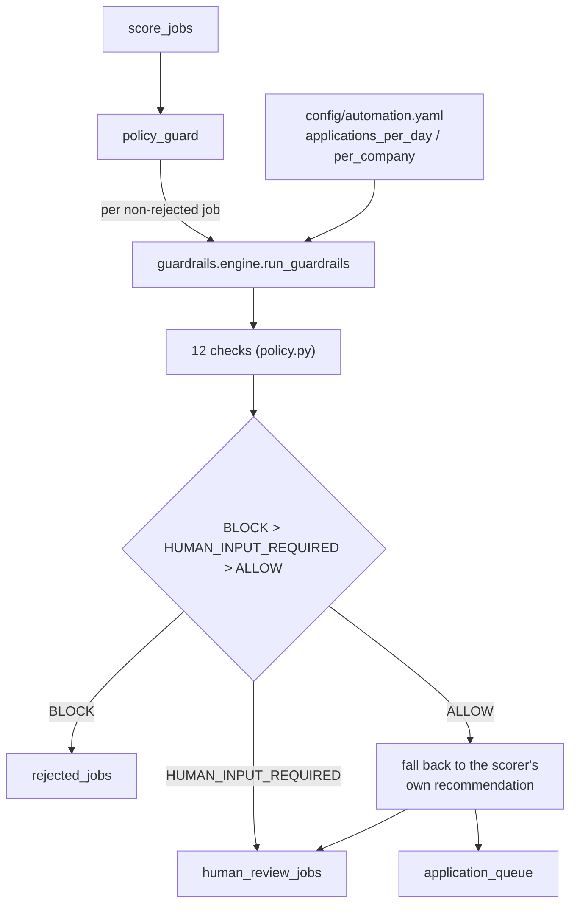

`app/guardrails/`: `models.py` (`GuardrailDecision` — `ALLOW`/`BLOCK`/
`HUMAN_INPUT_REQUIRED`, never a bare bool, so "blocked" and "needs a human"
can't be conflated), `policy.py` (12 checks: `minimum_match_score`,
`maximum_daily_applications`, `maximum_company_applications`,
`excluded_companies`/`_roles`/`_locations`, `minimum_salary`,
`experience_mismatch`, `required_work_authorization`,
`duplicate_application`, `resume_validation`, `mandatory_fields`), and
`engine.py` (orchestrates all 12, aggregates to one decision — BLOCK beats
HUMAN_INPUT_REQUIRED beats ALLOW).

**Guardrails have final say over the scorer, per Section 23** ("supervisor
must not bypass or override guardrails") — `policy_guard` runs every
non-rejected job through the engine after score-based routing, and a
guardrail can only make the outcome *more* restrictive (queue →
human_review → reject), never less. Verified live: a job scoring 91
(`priority_apply`) from an excluded company ends up in `rejected_jobs`,
its `reason` carrying both the original score explanation and the
guardrail note (`app/graph/nodes.py::_with_guardrail_note`).

**The concrete "never fabricate candidate information" guardrail**
(Section 17) is `check_experience_mismatch`: if the resume parser never
determined a number for the candidate's years of experience — Phase 1's
`ExtractedField.source == "unextracted"` — and the job states a minimum,
the check returns `HUMAN_INPUT_REQUIRED` rather than assuming eligibility
either way. It's the same provenance mechanism Phase 1 built for exactly
this purpose, not a separate new one. `required_work_authorization`
(Section 18) follows the identical pattern: `CandidatePreferences.
work_authorization` defaults to `None`, and stays `None` until the
candidate explicitly states it — never inferred.

No `applications`/`audit_events` tables exist yet, so
`maximum_daily_applications`/`maximum_company_applications` and
`duplicate_application` currently evaluate against `0`/`0`/an empty set
(`GuardrailContext`'s defaults) — the checks are fully implemented and unit
tested with non-trivial inputs, they just have no real history to count
against until Phase 7+ records actual submissions.

### Playwright form engine (Phase 5)

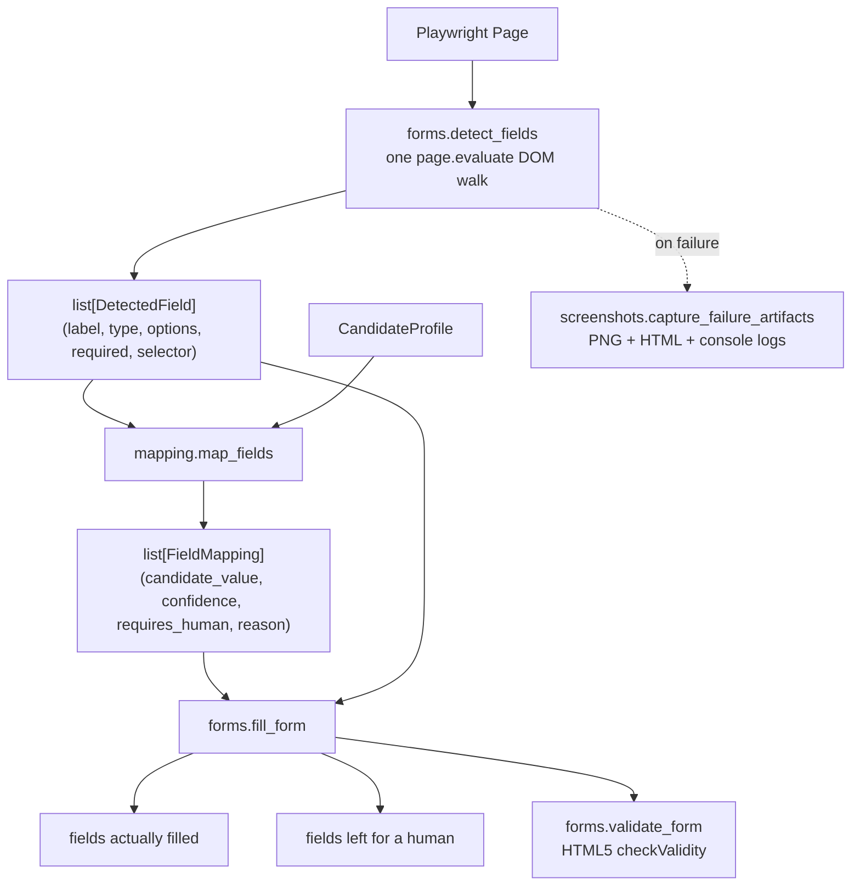

`app/browser/`: `manager.py` (launches/closes Chromium, headless
configurable), `sessions.py` (one persistent `BrowserContext` per portal,
cookies/storage saved to `data/browser_sessions/<portal>.json` so logging
in once doesn't mean logging in again next run), `selectors.py`
(`build_selector` — the priority order from Section 11: data-testid >
aria-label > role > name > id > CSS > text, pure function, no browser
needed to unit test it), `forms.py` (detect/fill/validate/upload, all
Playwright-dependent), `mapping.py` (the rule-based field-intelligence
module, Playwright-independent — pure function over `DetectedField` +
`CandidateProfile`), `screenshots.py`, `errors.py`, `models.py`
(`DetectedField`, `FieldMapping`, `FormFillResult`).

**Deterministic, not LLM-based — same reasoning as every prior phase.**
Phase 5 has no LLM yet (Phase 6); `mapping.py`'s keyword-pattern table
handles label→field recognition, exactly the kind of task Section 2 says
shouldn't wait for one. A future LLM-backed classifier (Phase 6) can
replace the matching logic without changing `FieldMapping`'s shape or any
caller — same swap-without-breaking-callers pattern as `semantic.py` in
Phase 2.

**Confidence and "requires human" are never conflated with the field
simply having no known pattern.** Section 20's exact output shape
(`field`, `candidate_value`, `confidence`, `requires_human`) is
`FieldMapping`. Below `FORM_MAPPING_CONFIDENCE_THRESHOLD` (default 0.7,
`config` via `.env`) a field is never auto-filled even if a value exists —
verified live: an 18-year-experience, no-name-on-file candidate profile
run against the simple fixture form correctly filled email/phone/experience
and left `full_name` for a human, with the reason spelled out
(`"recognized as 'name' but no value is on file"`).

**Section 18's sensitive categories have no representation in the
candidate model at all** — gender, ethnicity, disability, veteran status,
religion, security clearance, criminal history always resolve to
`requires_human=True` in `mapping.py`, not because confidence is low but
because there is structurally nothing to guess from.

**Fixtures, not production portals** (Section 42): `tests/fixtures/html/`
has all ten required scenarios — simple form, multi-step, dropdown,
resume upload, required fields, an unrecognized field, OTP screen, CAPTCHA
screen, success page, failure page. The OTP/CAPTCHA/success/failure pages
are fixtures only for now; nothing detects or reacts to them yet — that
wiring is Phase 6 (interrupt logic) and Phase 7 (submission verification)
respectively. All 11 e2e tests in `tests/e2e/test_form_engine.py` run
against a real headless Chromium instance via `file://` URLs, no server
required.

### Target LangGraph workflow (Phase 3 done through Guard; rest planned)

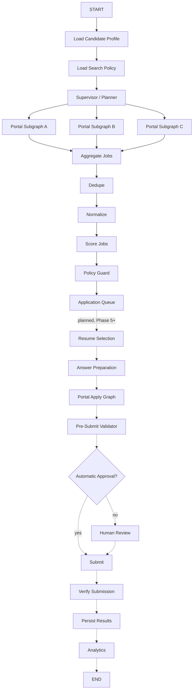

Note: implemented dedupe runs *after* normalize (needs title-family
canonicalization — Section 14's own "normalized title" matching key),
whereas this narrative diagram (carried over from the original design spec)
shows it before. See `app/graph/nodes.py::dedupe_jobs_node` for the
reasoning.

## Target portal subgraph (planned, Phase 7+)

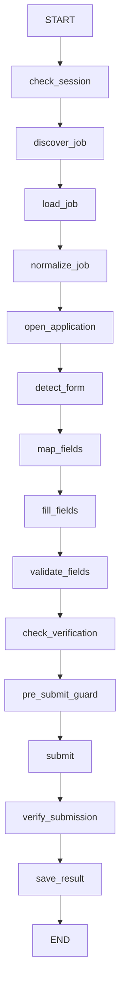

A portal subgraph failure must never terminate the supervisor run — failures
are caught, logged, and the run continues with the remaining portals.

## Target application state machine (planned)

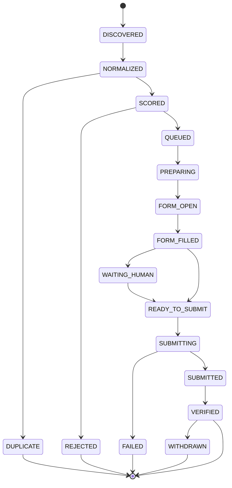

## Human-in-the-loop flow

One real instance of this pattern exists today (Phase 3): a job scoring in
the `human_review` band pauses the run via LangGraph's `interrupt()`. The
rest — CAPTCHA, OTP, unknown-field, low-confidence-mapping interrupts, and
a dedicated `/api/human-actions` review queue — are Phase 5/6+, once there's
a browser/form layer and portal-specific unknowns to interrupt for. The
mechanism (persist → notify → resolve → resume) is identical; only the
*reasons* and the API surface expand.

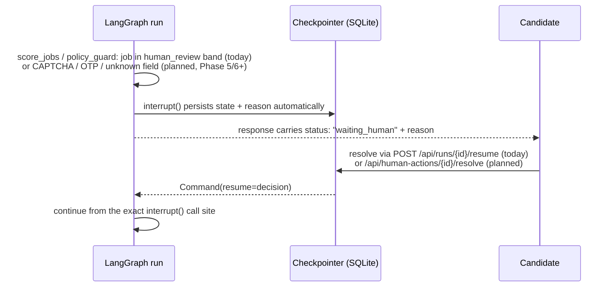

## Database relationships (planned, expanded per phase)

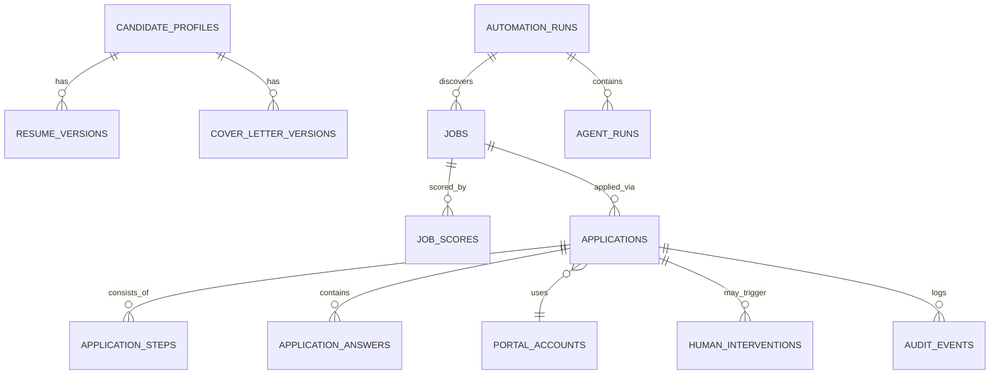

Phase 0 shipped only the async engine/session foundation
(`app/database/base.py`, `app/database/session.py`) and Alembic wiring
(`migrations/`) — no tables. Phase 1 adds the first one, `candidate_profiles`
(migration `99cc354684f4`), a simplified single-row version of the planned
`CANDIDATE_PROFILES`/`RESUME_VERSIONS`/`COVER_LETTER_VERSIONS` split above —
resume and cover-letter data live as JSON/text columns on one row rather
than versioned child tables, since there's exactly one local candidate and
no version history yet. Remaining tables are introduced as migrations in
the phases that need them — Phase 2 turned out to need none (it's a pure
scoring library with no discovery pipeline to persist yet); `jobs`/
`job_scores`/application tables arrive with the LangGraph pipeline in
Phase 3+, per Section 27 of the design spec.

## Deployment architecture (planned)

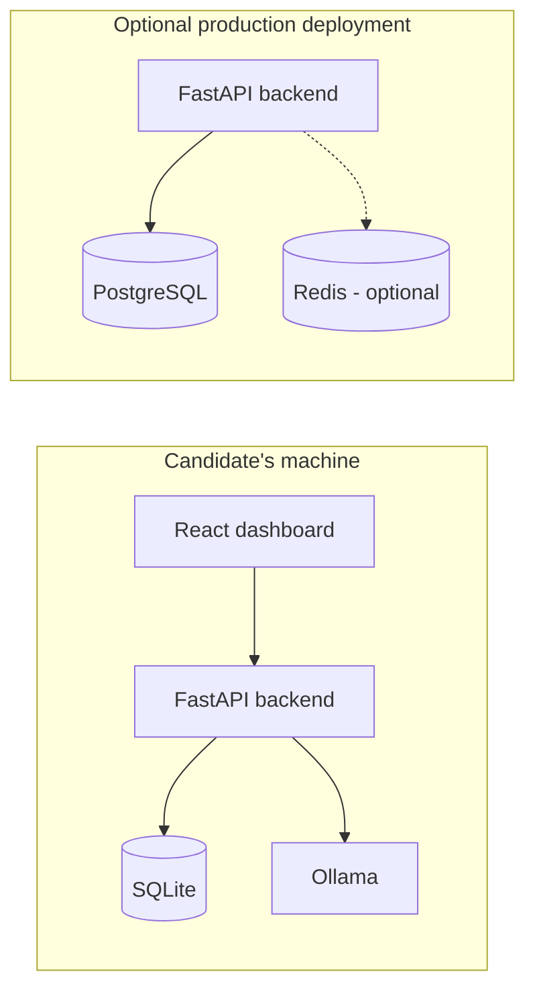

Docker Compose is not required for local development (`make dev` runs
everything directly); it exists for the optional production path.

## Design principles enforced by the codebase

- **LLM only where semantic interpretation is required.** Deterministic
  code owns salary checks, location filtering, duplicate detection,
  guardrails, retries, scheduling, and submission verification.
- **Config over code.** Candidate preferences, scoring weights, automation
  limits, and portal registration live in `config/*.yaml`, not Python.
- **Dry-run and manual approval by default.** See `SECURITY.md`.
- **No portal-specific fields leak into the common job model** — they live
  under `NormalizedJob.metadata` (introduced Phase 2).
- **The supervisor orchestrates; it doesn't do the work.** `app/graph/graph.py`
  only wires nodes/edges/fan-out — DB access, scoring, and policy decisions
  are plain functions in `nodes.py` that the supervisor calls, never inline
  logic in the graph definition itself (Section 23).
- **A run's state is never only in Python memory.** Every graph invocation
  opens a fresh checkpointer connection to disk rather than holding one open
  for the process lifetime — proven by killing and restarting the server
  mid-run and still resuming correctly (introduced Phase 3).
- **Guardrails can only tighten an outcome, never loosen one.** The scorer
  proposes (Phase 2); guardrails dispose (Phase 4) — a check can downgrade
  `priority_apply` to `reject`, but nothing downstream can upgrade a
  guardrail's `BLOCK` back to `ALLOW` (Section 23).
- **Unknown is a distinct outcome from allowed or blocked.**
  `GuardrailDecision` is a three-value enum, not a bool — code can't
  accidentally treat "needs a human" the same as "denied" or "approved"
  (Section 17/18's fabrication-prevention rules depend on this distinction).
- **No feature develops against a live external site as its test
  environment.** Job discovery uses mock portals (Phase 3); the form
  engine uses local HTML fixtures (Phase 5, Section 42). Both are
  real code exercised by real automation (a real headless browser, a
  real LangGraph run) — only the *target* is local and disposable.
